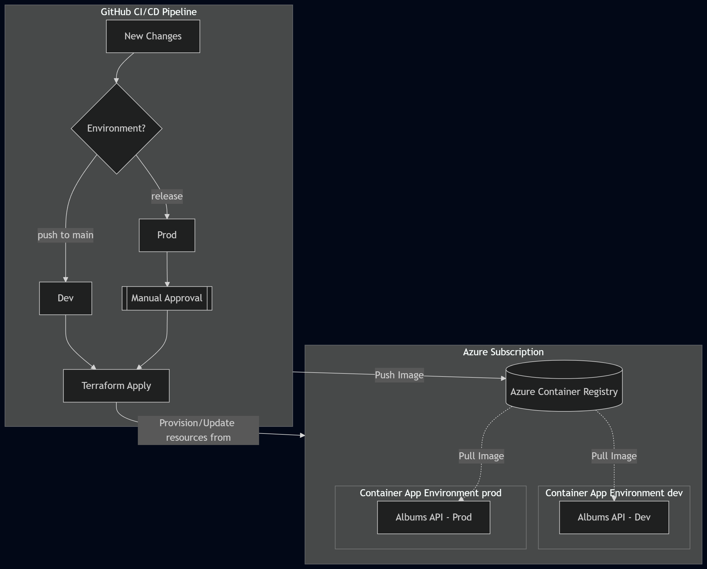

# Task - Albums API Deployment

## Table of Contents
1. [Overview](#overview)
2. [Architecture Diagram](#architecture-diagram)
3. [Environment Strategy](#environment-strategy)
4. [Infrastructure](#infrastruture)
7. [Local Access to Internal Service](#local-access-internal-service)
8. [Workflows and approvals](#workflows-and-approvals)

## Overview 
This project deploys a containerized HTTP API to Azure Container Apps.

This task is based on the Microsoft “Albums API” quickstart repository, which was used as the starting point for this matter: deploys a containerized HTTP API to Azure Container Apps.

## Architecture Diagram



## Environment Strategy
Two supported environments:

### Development (dev)
- Auto-deployed on push to main branch
- No manual approval
- Uses github sha as image tag

### Production (prod)
- Triggered from publishing a new release
- Requires manual approval
- Uses release tag as image tag

Since this a simple project, I decided to have separate .tfvars files for the environments and use them by running `terraform apply -var-file=<file>`. But it was also possible to have workspaces or different tfstates.

Both sharing the ACR and tfstate file.

## Infrastructure
With Terraform I provisioned: 
##### Shared
- Azure Container Registry (ACR)
- Storage Account 

##### Environmet-Specific
- Container App Environment 
- Container App 

## Local Access to Internal Service
N/A


## Workflows and approvals
Pipeline stages:

#### On Pull Request
1. CI
2. Build image

#### On push to main
1. CI
2. Build image
2. Push with sha tag
3. Deploy to dev

#### On release
1. CI
2. Build image
2. Push with release tag
3. Production Approval
3. Deploy to prod


The approval uses GitHub Environments protection rules. 

## Notes
 I’d use Terraform for infrastructure and CI/CD for deploying to container apps because seems more simple. Since the requirements asks Terraform-based deployment, I would pass the image tag as a variable and run terraform apply from the pipeline after building and pushing the image. 
 If this was not a requirement, I would add this instead to the CI/CD:

 ```bash
   - name: Deploy
          uses: azure/container-apps-deploy-action@v1
          with:
            resourceGroup: rg-${{ vars.APP_NAME }}-${{ inputs.ENVIRONMENT }}
            imageToDeploy: ${{ vars.REGISTRY }}/${{ github.repository }}:${{ inputs.TAG }}
            containerAppName: ca-${{ vars.APP_NAME }}-${{ inputs.ENVIRONMENT }}
            containerAppEnvironment: cae-${{ vars.APP_NAME }}-${{ inputs.ENVIRONMENT }}
```